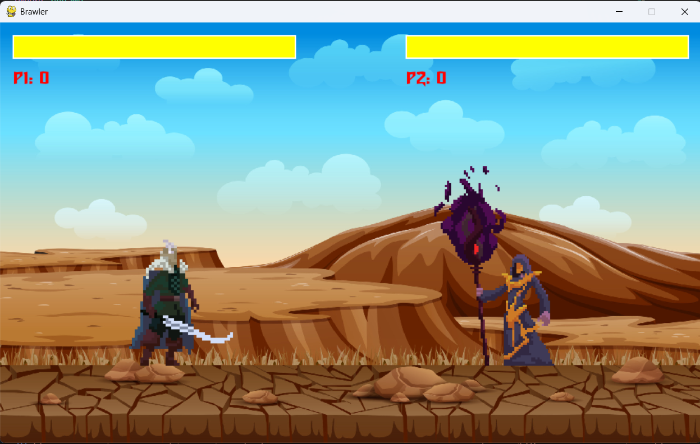

# ⚔️ Multiplayer Battle Arena (Python + Pygame)
A classic 2D fighting game built with **Pygame**, featuring two unique characters — a Warrior and a Wizard — battling it out with melee and magic attacks.  
The game includes animations, health bars, a round system, victory screens, and background music.

---

## 🎮 Features
- **Two playable characters** with different spritesheets
- **Attack combos** (two attack types per character)
- **Jumping, running, idle, hit, and death animations**
- **Countdown timer** before each round starts
- **Health bars** and scoring system
- **Victory screen** between rounds
- **Background music** and sound effects
- **Simple controls** for two players on the same keyboard

---

## 🕹️ Controls
### **Player 1**
| Action      | Key  |
|-------------|------|
| Move Left   | A    |
| Move Right  | D    |
| Jump        | W    |
| Attack 1    | R    |
| Attack 2    | T    |

### **Player 2**
| Action      | Key              |
|-------------|------------------|
| Move Left   | ← (Left Arrow)   |
| Move Right  | → (Right Arrow)  |
| Jump        | ↑ (Up Arrow)     |
| Attack 1    | Numpad 1         |
| Attack 2    | Numpad 2         |

---

## 📂 Folder Structure
brawler/
│
├── assets/
│   ├── audio/
│   │   ├── music.mp3
│   │   ├── sword.wav
│   │   └── magic.wav
│   ├── fonts/
│   │   └── turok.ttf
│   ├── images/
│   │   ├── background/
│   │   │   └── background.jpg
│   │   ├── icons/
│   │   │   └── victory.png
│   │   ├── warrior/
│   │   │   └── Sprites/warrior.png
│   │   └── wizard/
│   │       └── Sprites/wizard.png
│
├── main.py
├── fighter.py
└── README.md

---

## 🖼️ Screenshots

Example:  

---

## 📦 Installation & Setup

### 🚀 How to Run
### 1️⃣ Install Dependencies
Make sure you have **Python 3** installed.  
Install `pygame`: 
`pip install pygame`

**Clone the repository**
   `git clone https://github.com/your-username/multiplayer-battle-arena.git`
   `cd multiplayer-battle-arena`

### 2️⃣ Run the Game
In the project folder:
python `main.py`

---

## 🛠️ Technologies Used
* **Python 3**
* **Pygame** (for rendering, input handling, and sound)
* **Spritesheets** for animation
* **Custom pixel art and audio**

---

## 🎮 Future plans
- **Multiplayer & AI Mode** – Play with friends or against the computer.
- **Character Selection** – Choose from multiple fighters with unique animations.
- **Sprite Sheet & Folder Animations** – Supports both styles for smooth motion.
- **Animated Backgrounds** – Immersive arena visuals.
- **Dynamic Rounds** – Fighters respawn and continue until a winner emerges.

---

## 📜 License
This project is for **learning purposes**.
If you use the code or assets, please credit the original creators.

---

## 👨‍💻 Author
Created by **Muhammad Anas** — Inspired by classic arcade fighting games.

---
